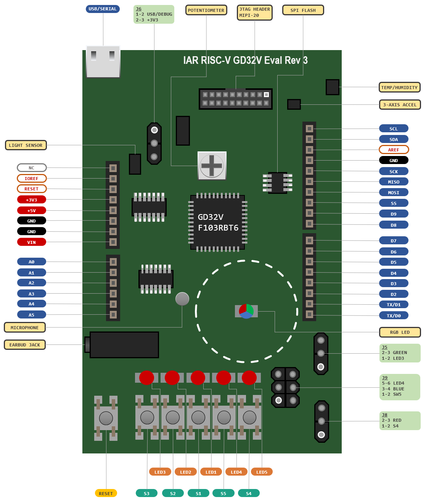
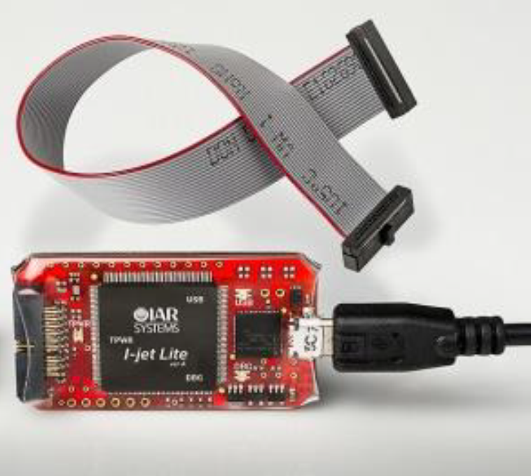
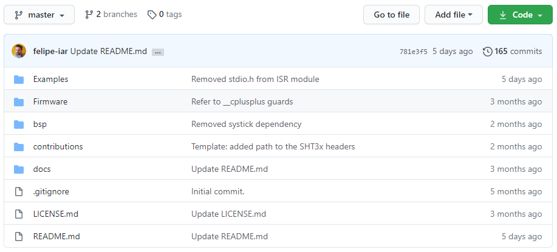
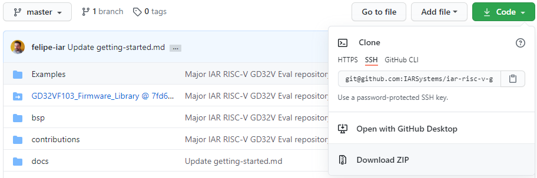
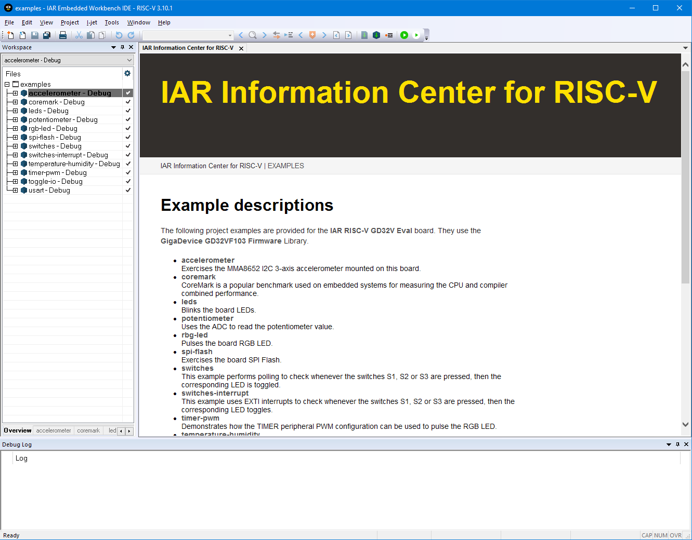
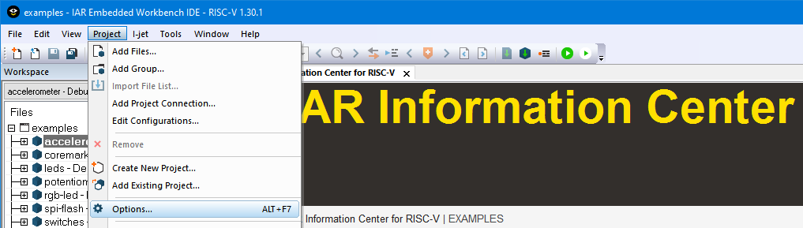
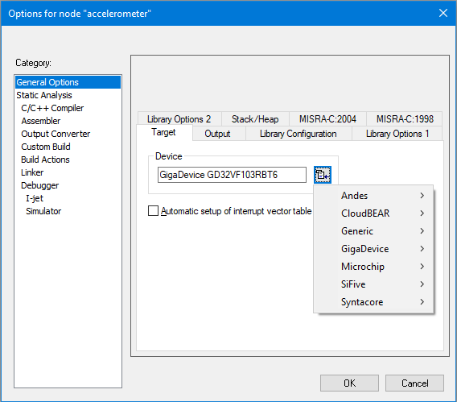
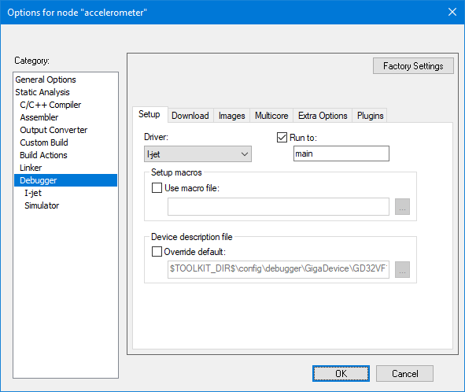
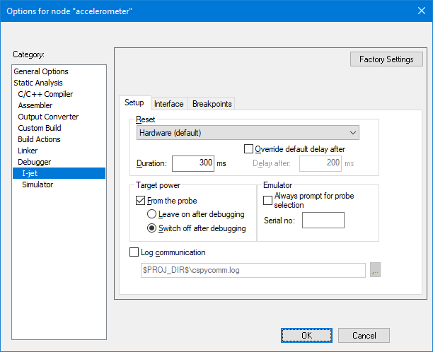

# Getting started with the IAR RISC-V GD32V Eval board

This guide briefly describes how to get started using __[IAR Embedded Workbench for RISC-V](https://www.iar.com/riscv)__ with the __I-jet Lite__ debug probe, to run its example projects on the [IAR RISC-V GD32V Eval board](https://iar.com/evalkit). 

## Table of contents
* [IAR RISC-V GD32V Eval board at a glance](#iar-risc-v-gd32v-eval-board-at-a-glance)
* [I-jet Lite debug probe](#i-jet-lite-debug-probe)
* [Install IAR Embedded Workbench for RISC-V](#install-iar-embedded-workbench-for-risc-v)
* [Set up the evaluation board](#set-up-the-evaluation-board)
* [Clone the repository](#clone-the-repository)
* [Build and Debug the example projects](#build-and-debug-the-example-projects)
* [View and edit project options](#view-and-edit-project-options)
* [Target power supply from I-jet Lite](#target-power-supply-from-i-jet-lite)
* [Troubleshooting](#troubleshooting)


## Getting Started

### IAR RISC-V GD32V Eval board at a glance



> Click on the [board layout](images/07-board-layout.png) to enlarge.

---


* GD32VF103RBT6 RISC-V GigaDevice MCU
* User [LEDs](../Examples/leds)
* [RGB LED](../Examples/rgb-led)
* User [switches](../Examples/switches)
* [Potentiometer](../Examples/potentiometer)
* I²C 3-axis [accelerometer](../Examples/accelerometer)
* I²C [temperature-humidity](../Examples/temperature-humidity) sensors
* Light sensor
* On-board microphone
* iPhone compatible earbud jack
* [SPI flash](../Examples/spi-flash) memory
* Reset button 
* JTAG connector 20-pin 0.05” 
* USB micro-B connector for USB/Serial converter 
* Power can be supplied directly from the USB connector (__J7__) or from the I-jet Lite (__J11__ pins 11 and 13)


### I-jet Lite debug probe 



* CPU support: RISC-V cores, Arm Cortex-M/A/R cores 
* Hi-speed USB 2.0 interface
* Debugging interfaces: JTAG, SWD
* Single-Wire Output (SWO) support  
* Flash the firmware image into the MCU
* Target can be powered from the debugging interface (up to 5V) 
* MIPI-20 flat cable and USB micro B cable are included 
* Fully integrated with the IAR Embedded Workbench for RISC-V (and for Arm) 
* RoHS/CE compliant (used with evaluation kit only)
 
## Install IAR Embedded Workbench for RISC-V

Please refer to the installation instructions from the welcome e-mail for the RISC-V evaluation kit.


## Set up the evaluation board

1. Connect one end of the MIPI-20 flat cable to the I-jet Lite and the other end of the cable to the __J11__ JTAG header on the evaluation board.

2. Connect the I-jet Lite to an USB port of the host PC using the USB micro B cable.

> __Notes__
> * The __USB__ indicator on the I-jet Lite should turn on green as soon as Windows recognizes the device.
>
> * The I-jet Lite requires an USB 2.0 port on the host PC.
>
> * The I-jet Lite can power the evaluation board. Refer to the section [Target power supply from I-jet Lite](5-target-power-supply-from-i-jet-lite) for more details. 
>
> * The [Debug Probes User Guide](https://netstorage.iar.com/SuppDB/Public/UPDINFO/014860/riscv/doc/EWRISCV_DebugProbes.pdf) provides further information.


## Clone the repository

Once you have finished to install and setup the required software and hardware for the development environment, it is time to clone the repository containing the [example projects](https://github.com/IARSystems/iar-risc-v-gd32v-eval/tree/master/Examples). 

Cloning the repository must be performed only once until decided to upgrade to the latest version available on the repository and there are many methods of cloning it. Below the steps for the two most common methods.

### Using Git (preferred way)

1. Using a Git client (such as [Git for Windows](https://git-scm.com/download/win)), launch __Git CMD__ and then perform the following commands to clone this repository.
```
md %PROGRAMDATA%\IARSystems\EmbeddedWorkbench\DownloadedExamples\riscv

cd %PROGRAMDATA%\IARSystems\EmbeddedWorkbench\DownloadedExamples\riscv

git clone https://github.com/IARSystems/iar-risc-v-gd32v-eval.git --recurse-submodules
```

> __Note__
> * It is important to clone with `--recurse-submodules` because the __GD32VF103 Firmware Library__ is fetched directly from its official GitHub repository.
> * After the repository is cloned for the first time, it can be updated in a similar manner, by changing to its directory and pulling the updates as below:
>
> ```
> cd %PROGRAMDATA%\IARSystems\EmbeddedWorkbench\DownloadedExamples\riscv\iar-risc-v-gd32-eval
>
> git pull --recurse-submodules
> ```
>
> * The __IAR GD32V RISC-V Board Examples__ were tested with the __GD32VF103 Firmware Library V1.1.0__.



### Using ZIP (alternate way)

1. Create the folder `%PROGRAMDATA%\IARSystems\EmbeddedWorkbench\DownloadedExamples\riscv` if needed.

2. Go to the [iar-risc-v-gd32v-eval](https://github.com/IARSystems/iar-risc-v-gd32v-eval) repository page.

3. Click on the __`Code`__ button to unfold the _Clone_ menu.

4. Choose __Download ZIP__.



5. Save the __iar-riscv-v-gd32v-eval-master.zip__ to the folder `riscv` created during the step 1 and extract it there.

6. Click on the [__GD32VF103_Firmware_Library @ 7fd6c43__](https://github.com/GigaDevice-Semiconductor/GD32VF103_Firmware_Library/tree/7fd6c43a723c2d9b96ef337fd22f05cfefee0e9d).

> __Note__
> * This commit is the Firmware Library tagged as V1.1.0.

7. Repeat steps 3 and 4.

8. Save the __GD32VF103_Firmware_Library-7fd6c43a723c2d9b96ef337fd22f05cfefee0e9d.zip__ file to `riscv\iar-risc-v-gd32v-eval-master`.

9. Open the __GD32VF103_Firmware_Library-7fd6c43a723c2d9b96ef337fd22f05cfefee0e9d.zip__ file and extract the contents of the __Firmware__ folder to `riscv\iar-risc-v-gd32v-eval-master\GD32VF103_Firmware_Library`.

## Build and Debug the example projects

1. From the Windows Start menu, launch the __IAR Embedded Workbench IDE__ by choosing __IAR Systems__ → __IAR Embedded Workbench for RISC-V__.

2. Go to `Help` → `Information Center` → `Example projects` → `IAR RISC-V GD32V Eval` → `IAR RISC-V GD32V Eval board examples` and finally click on `Select Folder` to save this Workspace to its default location, inside the `%USERPROFILE%\Documents\IAR Embedded Workbench` folder.



3. Select the desired project: right-click on the project name in the __Workspace__ window and `Set as Active`. 

4. Unfold the project in the __Workspace__ window and open its __README.md__ file. The README.md file provides any specific board setup or details specific to the active project.

5. Choose `Project` → `Make` (or <kbd>F7</kbd>) or click the `Make` button on the main toolbar to compile and link the project.

6. Choose `Project` → `Download and Debug` (or <kbd>CTRL</kbd> + <kbd>D</kbd>) or click the `Download and Debug` button on the _Debug Toolbar_. This action will launch the __IAR C-SPY Debugger__.

> __Notes__
> * When in an __IAR C-SPY Debugger__ session, the IDE menu will slightly change, providing new menu options for debugging. Also, a new _Debug Toolbar_ will appear, providing functionality to control the downloaded application's execution flow. 
> * The downloaded application will execute automatically on target until it reaches the entry point of the application's `main()` function, where its execution will remain paused until an user action changes the execution flow. The Code Editor window will display the source file containing the `main()` function, highlighting the line where the application currently is.

7. Click `Debug` → `Go` (or <kbd>F5</kbd>) or click the `Go` button on the _Debug Toolbar_ to resume the downloaded application execution. 

8. To halt the execution, choose `Debug` → `Break` or click the `Break` button on the _Debug Toolbar_.

9.	To exit the __IAR C-SPY Debugger__, choose `Debug` → `Stop Debugging` (or <kbd>CTRL</kbd> + <kbd>SHIFT</kbd> + <kbd>D</kbd>) or click the `Stop Debugging` button on the _Debug Toolbar_.

> __Note__
> * You can `Set as Active` any project from this workspace and repeat the process.

##  View and edit project options

1. Make sure the desired project name is __highlighted__ in the workspace window. On the `Project` menu, select `Options`. An __Options for node `<active-project>`__ window will be displayed.


 
2. The Project Options window offers a graphical user interface for conveniently setting all the options for the build configuration. For example, by selecting processor family and device under the __Target__ _tab_ of the __General Options__ _Category_, the appropriate linker configuration and device description for the debugger are automatically selected for the chosen device.


 
3. Select the __Debugger__ in the category. The option `Run to` is used to specify a function for an automatic initial breakpoint when the application is executed during a C-SPY Debugger. By default, IAR Embedded Workbench will insert a breakpoint in the `main()` function entry point. This is particularly useful for skipping the application's low-level initialization functions. 


 
4. Click `OK` if you want to save your settings.

## Target power supply from I-jet Lite
To power the evaluation board directly from the I-jet Lite, proceed as follows.

1. Choose `Project` → `Options` → `I-jet` → `Setup` to enable __Target power__ supply from the I-jet Lite. 



2. Then, on the board, use a jumper on __J6__ to connect the pins `1-2` (for USB/Debug).
 
## Troubleshooting
If you are unable to find the cause of a problem, try the following:
- Try to press the board's `RESET` button.
- Try to restart the C-SPY Debugger in the IAR Embedded Workbench IDE. 
- Try disconnecting and reconnecting the power to the evaluation board and then repeat the previous sequence with the `RESET` followed by restarting of the C-SPY.

---
### Disclaimer
Information provided in this document is intended for helping new IAR Embedded Workbench users on how to get started. IAR Systems shall not be held liable for any losses or problems arising from using the information given in this document. 
