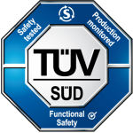

# SAFERTOS® Demo for RISC-V with IAR on GigaDevice32

SAFE**RTOS**® is a pre-certified safety Real Time Operating System (RTOS) for embedded processors. It delivers superior performance and pre-certified dependability, whilst utilizing minimal resources.                                  

- Developed by [WITTENSTEIN high integrity systems][ws-url], a safety systems company 
- Supports a wide range of international development standards
- Based on the FreeRTOS functional model
- Available pre-certified to IEC 61508-3 SIL 3 by TÜV SÜD
- Available pre-certified to ISO 26262 ASIL D by TÜV SÜD
- Part of the WITTENSTEIN group, established in 1948 

_A fully functional, time-limited SAFE**RTOS** demo running on the GigaDevice32 with IAR Embedded Workbench for RISC-V is available for free download from [https://www.highintegritysystems.com/safertos][sr-url]_

Create an account with the download centre to access user manuals, datasheets, and a workshop detailing the transition from FreeRTOS to SAFE**RTOS**, as well as a range of SAFE**RTOS** demos supporting IAR.

## Why SAFERTOS®?

SAFE**RTOS**® is tailored to your specific processor/compiler combination, and delivered with full source code and the [WITTENSTEIN high integrity systems][ws-url] Design Assurance Pack (DAP). The DAP gives you complete transparency over the full Design Life Cycle, and illustrates the exceptional high quality of our RTOS product. The DAP ensures:

- No retesting on target hardware is required
- Easy installation and integration into your development environment
- Reduced development costs and improved time to market
- Smooth path to certifying SAFE**RTOS** within an application

### Designed for Functional Safety
SAFE**RTOS**® was initially certified in 2007 by TÜV SÜD to IEC 61508-3 SIL 3, the highest level possible for a software only component.

Today SAFE**RTOS** has grown to be a leading safety critical RTOS solution supporting a wide range of international safety design standards, including:
-  Industrial – IEC 61508 -1,-3,-4
-  Medical – FDA 510(k), IEC 62304
-  Automotive – ISO 26262 -2,-6,-8

[Visit the download centre and download a SAFERTOS demo today][dc-url].

<!-- links --> 
[dc-url]: https://www.highintegritysystems.com/down-loads/manuals-datasheets/safertos-datasheet-downloads
[ws-url]: https://www.highintegritysystems.com
[sr-url]: https://www.highintegritysystems.com/safertos
